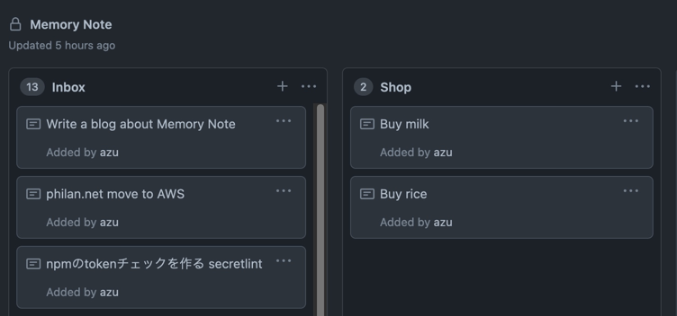
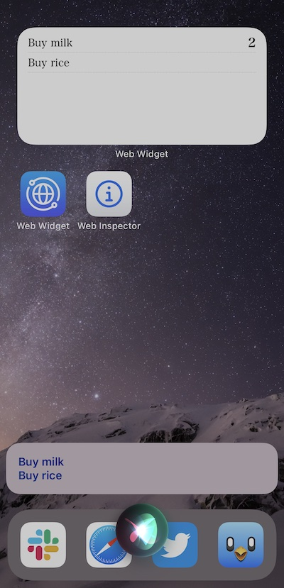
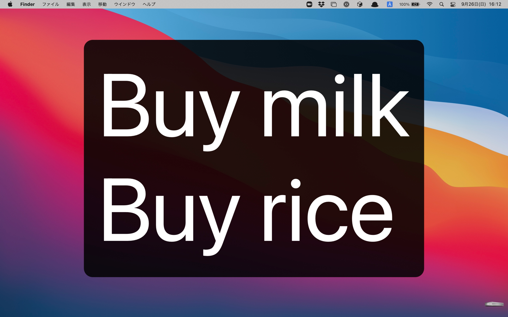
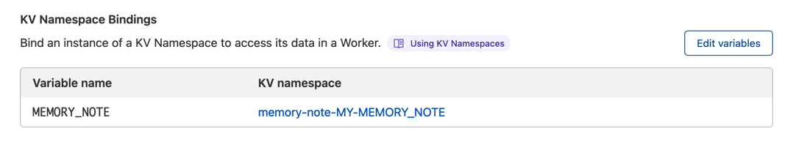
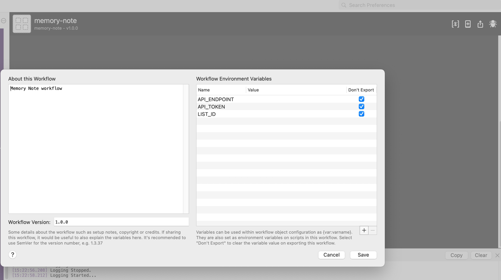

# memory-note 

Fast memory note for your brain.

## Features

- Fast - Memory Notes works on [Cloudflare Workers](https://workers.cloudflare.com/)
  - Customizable Backend - Use Cloudflare Worker KV or GitHub Projects as backend
    - Also, you can create own backend by implementing 3 APIs
- Flexible Frontend - Memory Notes interface is just REST API. You can create any frontend
    - iOS shortcut.app, iOS Widgets, Alfred Workflow

### Screenshots



> use GitHub Project Board as backend



> iOS Widgets using [Web Widget](https://apps.apple.com/jp/app/web-widget-webpage-screenshot/id1561605396) and Siri integrations



> Alfred workflow integration

## Usage

Requirements: [Cloudflare](https://www.cloudflare.com/) account

1. Click [](https://deploy.workers.cloudflare.com/?url=https://github.com/azu/memory-note)
2. Deploy memory-note
3. Set Environment Variables to your memory-note
   1. Visit Cloudflare Workers Settings: `https://dash.cloudflare.com/{your account id}/workers/view/memory-note/settings`
   2. Set following Environment Variables

### Environment Variables

- `MEMORY_NOTE_TOKEN`: It is random value. This is used for authorization.
  - You need to access your memory note using `?token=<MEMORY_NOTE_TOKEN>`.
  - You can use random password generator like <https://passwordsgenerator.net/>
- `BACKEND_SERVICE`: backend service
  - `github` or `cloudflare` is supported 
  - Default: `cloudflare`
- Other vars is defined in each Backend Service

:memo: all values should be encrypted. 

### Backend Service

Currently, Memory Note supports following backend:

- `cloudflare`: Cloudflare Workers KV
- `github`: GitHub Project Board

:memo: If you want to add new backend, please submit Pull Request!

[StorageAdapter.ts](./src/note/StorageAdapter.ts) is an interface for backend.

#### `cloudflare` backend

You need to create KV Binding.

1. Visit `https://dash.cloudflare.com/{your account id}/workers/kv/namespaces`
2. Add new Namespace like `MY_MEMORY_NOTE`
3. Visit `https://dash.cloudflare.com/{your account id}/workers/view/memory-note/settings`
4. Add new KV Namespace Bindings
   - `Variable name`: `MEMORY_NOTE`
   - `KV namespace`: created KV Namespace(`MY_MEMORY_NOTE`)



5. Add new Environment Variables

- `MEMORY_NOTE_TOKEN`
    - `Variable name`: `MEMORY_NOTE_TOKEN`
    - `Value`: your defined random password
- `BACKEND_SERVICE`
    - `Variable name`: `BACKEND_SERVICE`
    - `Value`: `cloudflare`

#### `github` backend

You need to create GitHub Projects Board and Get your GitHub API Token

**1. Create Project and Get Column Id**

1. Create a GitHub Repository
2. Create a GitHub Project on the repository
   - <https://docs.github.com/en/issues/organizing-your-work-with-project-boards/managing-project-boards/creating-a-project-board>
3. Create a column like "Memory Note"
4. Copy Column link
5. Get Column id from the copied link


This **Column id** is `:listId` value of API endpoint.

For example, if column link is `https://github.com/yourname/yourrepo/projects/1#column-1111111`, `1111111` is `column_id`. You need to copy it.
You can use the column id as `:listId`.

```bash
$ curl https://example-memory-note.worker.dev/notes/1111111?token=random-password
```

**2. Get GitHub API Token**

1. Visit <https://github.com/settings/tokens/new>
2. Create new API Token
    - permissions: `repo`
3. Copy it

**3. Add Environments Variables to Cloudflare Workers**

Add some Environment Variables.

Visit `https://dash.cloudflare.com/{your account id}/workers/view/memory-note/settings`

- `MEMORY_NOTE_TOKEN`
    - `Variable name`: `MEMORY_NOTE_TOKEN`
    - `Value`: your defined random password
- `BACKEND_SERVICE`:
    - `Variable name`: `BACKEND_SERVICE`
    - `Value`: `github`
- `GITHUB_OWNER`:
    - `Variable name`: `GITHUB_OWNER`
    - `Value`: your GitHub account name
- `GITHUB_REPO`:
    - `Variable name`: `GITHUB_REPO`
    - `Value`: your GitHub repository name
- `GITHUB_PROJECT_ID`
    - `Variable name`: `GITHUB_PROJECT_ID`
    - `Value`: your GitHub Project id
- `GITHUB_TOKEN`
    - `Variable name`: `GITHUB_TOKEN`
    - `Value`: your GitHub API token

For example, if you have used `https://github.com/your/my-note/projects/1` repo, you need to set `GITHUB_OWNER=your` and `GITHUB_REPO=my-note`, and `GITHUB_PROJECT_ID=1`.


## API

Memory-Note provides following API.

### `GET /notes/:listId`

Return an array of notes.

Parameters:

- `:listId`: note key. This use-case is defined by adapter.
    - on `github`: your project column id
    - on `cloudflare`: any string

Query:

- `?limit`: result item count
- `&token`: Your Memory Note token

Example:

```
# curl https://{your worker}/notes/{your GitHub Project Column Id}?token={your Memory Note Token}
$ curl https://example-memory-note.worker.dev/notes/11111?token=random-password
```

### `GET /notes/:listId/widget`

Return simple html page for widgets.

You can show your notes on Widgets app like [Web Widget](https://apps.apple.com/jp/app/web-widget-webpage-screenshot/id1561605396).

### `POST /notes/:listId/new`

Post a note that following json data.

```typescript
type NoteBody = {
    message: string;
};
```

Example of post data.

```json
{
  "message": "test"
}
```

Parameters:

- `:listId`: note key. This use-case is defined by adapter.

Query:

- `?token`: Your Memory Note token

### `PUT /notes/:listId/:noteId`

Edit a note with the `:noteId`

```typescript
type NoteBody = {
    message: string;
};
```

Example of post data.

```json
{
  "message": "test"
}
```

Parameters:

- `:listId`: note key. This use-case is defined by adapter.
- `:noteId`: note id. you can get the id from GET api

Query:

- `?token`: Your Memory Note token

### `DELETE /notes/:listId/:noteId`

Delete the note.

Parameters:

- `:listId`: note key. This use-case is defined by adapter.
- `:noteId`: note id. you can get the id from GET api

Query:

- `?token`: Your Memory Note token

### `POST /notes/:listId/move/:noteId`

Move the note to another list.

- `:listId`: note key. This use-case is defined by adapter.
- `:noteId`: note id. you can get the id from GET api

Body:

- `to`: to list id

```shell
{
  "to": "another list id"
}
```

## Clients

You can use client app for Memory Note.

### Alfred

Alfred workflow can show notes in large types, add a new note, remove a note.

- Download [memory-note.workflow](docs/alfred/memory-note.alfredworkflow)
- Set [Workflow Variables](https://www.alfredapp.com/help/workflows/advanced/variables/)



[Workflow Variables](https://www.alfredapp.com/help/workflows/advanced/variables/)

- `API_ENDPOINT`: your cloudflare worker url
  - Example, `https://my-memory-note.you.workers.dev`
- `API_TOKEN`: your memory note token
- `LIST_ID`: your main `:listId`

### iOS shortcuts.app:
 
iOS shortcut can create a new note using voice(siri), read out notes.

- Add note using voice to memory note: <https://www.icloud.com/shortcuts/c716e19f25cd48f59ca3d0e81cf84771>
- Read memory note: <https://www.icloud.com/shortcuts/67f0b9fe76bc450bbd184760554c94ca>
 
:memo: You input `worker url` and `:listId` and `memory note token` after installing the workflow

### Others

- [ ] Please submit a Pull Request

## Contributing

1. Fork it!
2. Create your feature branch: `git checkout -b my-new-feature`
3. Commit your changes: `git commit -am 'Add some feature'`
4. Push to the branch: `git push origin my-new-feature`
5. Submit a pull request :D

## License

MIT
