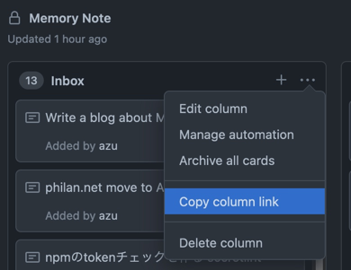
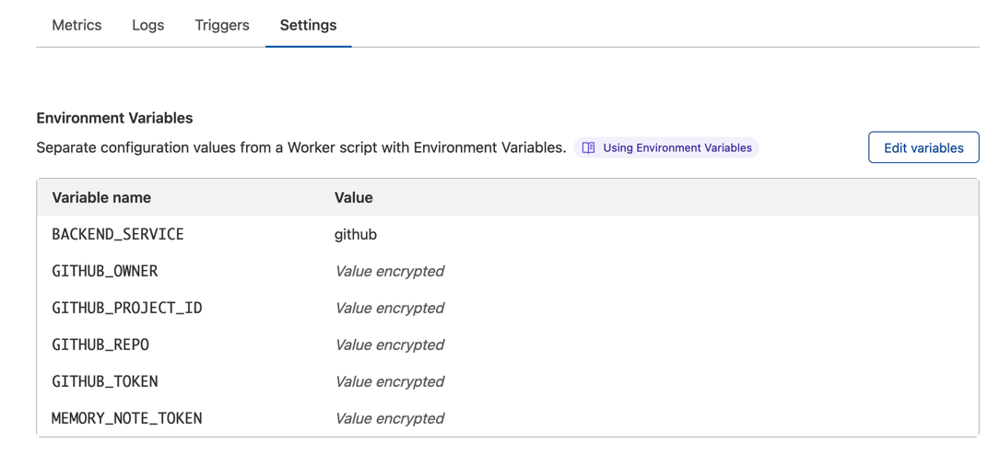

# memory-note 


## Usage

1. Click [](https://deploy.workers.cloudflare.com/?url=https://github.com/azu/memory-note)
2. Deploy memory-note
3. Set Environment Variables to your memory-note
   1. Visit Cloudflare Workers Settings: `https://dash.cloudflare.com/{your account id}/workers/view/memory-note/settings`
   2. Set following Environment Variables

### Environment Variables

- `MEMORY_NOTE_TOKEN`: It is random value. This is used for authorization.
  - You need to access your memory note using `?token=<MEMORY_NOTE_TOKEN>`.
  - You can use random password generator like <https://passwordsgenerator.net/>
- `BACKEND_SERVICE`: backend service
  - `github` or `cloudflare` is supported 
  - Default: `cloudflare`
- Other vars is defined in each Backend Service

### Backend Service

Currently, Memory Note supports following backend:

- `cloudflare`: Cloudflare Workers KV
- `github`: GitHub Project Board

:memo: If you want to add new backend, please submit Pull Request!

#### `cloudflare` backend

You need to create KV Binding.

1. Visit `https://dash.cloudflare.com/{your account id}/workers/kv/namespaces`
2. Add new Namespace like `MY_MEMORY_NOTE`
3. Visit `https://dash.cloudflare.com/{your account id}/workers/view/memory-note/settings`
4. Add new KV Namespace Bindings
   - `Variable name`: `MEMORY_NOTE`
   - `KV namespace`: created KV Namespace(`MY_MEMORY_NOTE`)


5. Add new Environment Variables

- `MEMORY_NOTE_TOKEN`
    - `Variable name`: `MEMORY_NOTE_TOKEN`
    - `Value`: your defined random password
- `BACKEND_SERVICE`
    - `Variable name`: `BACKEND_SERVICE`
    - `Value`: `cloudflare`

#### `github` backend

You need to create GitHub Projects Board and Get yoour GitHub API Token

**Create Project and Get Column Id**

1. Create a GitHub Repository
2. Create a GitHub Project on the repository
   - <https://docs.github.com/en/issues/organizing-your-work-with-project-boards/managing-project-boards/creating-a-project-board>
3. Create a column like "Memory Note"
4. Copy Column link
5. Get Column id from the copied link

This **Column id** is `:key` value of API endpoint.

For example, if column link is `https://github.com/yourname/yourrepo/projects/1#column-1111111`, `1111111` is `column_id`. You need to copy it.



**Get GitHub API Token**

1. Visit <https://github.com/settings/tokens/new>
2. Create new API Token
    - permissions: `repo`
3. Copy it

**Add Environments Variables to Cloudlfare Workers**

Add some Environment Variables.

Visit `https://dash.cloudflare.com/{your account id}/workers/view/memory-note/settings`

- `MEMORY_NOTE_TOKEN`
    - `Variable name`: `MEMORY_NOTE_TOKEN`
    - `Value`: your defined random password
- `BACKEND_SERVICE`:
    - `Variable name`: `BACKEND_SERVICE`
    - `Value`: `github`
- `GITHUB_OWNER`:
    - `Variable name`: `GITHUB_OWNER`
    - `Value`: your GitHub account name
- `GITHUB_REPO`:
    - `Variable name`: `GITHUB_REPO`
    - `Value`: your GitHub repository name
- `GITHUB_PROJECT_ID`
    - `Variable name`: `GITHUB_PROJECT_ID`
    - `Value`: your GitHub Project id
- `GITHUB_TOKEN`
    - `Variable name`: `GITHUB_TOKEN`
    - `Value`: your GitHub API token

For example, if you have used `https://github.com/you/my-note/projects/1` repo, you need to set `GITHUB_OWNER=your` and `GITHUB_REPO=my-note`, and `GITHUB_PROJECT_ID=1`.



## API

Memory-Note provides following API.

### `GET: /notes/:key`

Return an array of notes.

Parameters:

- `:key`: note key. This use-case is defined by adapter.
    - on `github`: your project column id
    - on `cloudflare`: any string

Query:

- `?limit`: result item count
- `&token`: Your Memory Note token

Example:

```
curl https://{your worker name}.workers.dev/notes/{your GitHub Project Column Id}?token={your Memory Note Token}
```

### `GET /notes/:key/widget`

Return simple list page for widgets.

You can show the `key` note on Widgets app like [Web Widget](https://apps.apple.com/jp/app/web-widget-webpage-screenshot/id1561605396).


### `POST /notes/:key/new`

Post a note that following json data.

```typescript
type NoteBody = {
    message: string;
};
```

Example of post data.

```json
{
  "message": "test"
}
```

Parameters:

- `:key`: note key. This use-case is defined by adapter.

Query:

- `?token`: Your Memory Note token

### `PUT /notes/:key/:id`

Edit a note with the `:id`

```typescript
type NoteBody = {
    message: string;
};
```

Example of post data.

```json
{
  "message": "test"
}
```

Parameters:

- `:key`: note key. This use-case is defined by adapter.
- `:id`: note id. you can get the id from GET api

Query:

- `?token`: Your Memory Note token

### `DELETE /notes/:key/:id`

Delete the note.

Parameters:

- `:key`: note key. This use-case is defined by adapter.
- `:id`: note id. you can get the id from GET api

Query:

- `?token`: Your Memory Note token

### `POST /notes/:key/move/:id`

Move the note to another list.

- `:key`: note key. This use-case is defined by adapter.
- `:id`: note id. you can get the id from GET api

Body:

- `to`: to list id

```shell
{
  "to": "another list id"
}
```
